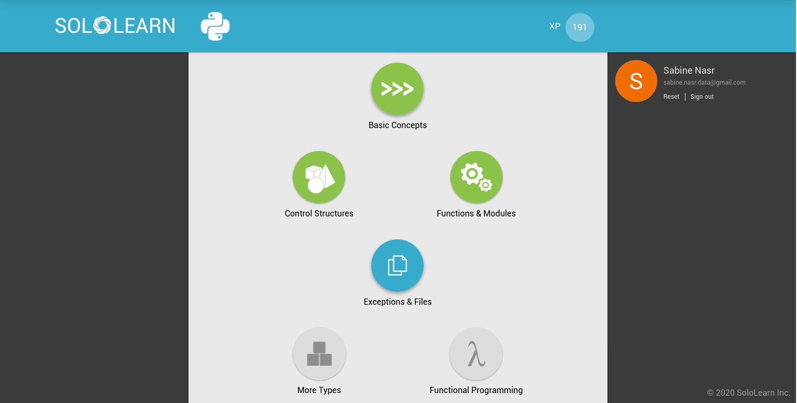

# Lundi 20/12/2020

On continue le travail sur le projet open data.
C'est un travail qui a commencé le 06/01/2020.
Les étapes sont les suivantes :

-[x] Importation de la base Sirene (stock etablissement et l'historique) sur site :
        https://www.data.gouv.fr/fr/datasets/base-sirene-des-entreprises-et-de-leurs-etablissements-siren-siret/#_

- [x] Veille sur la documentation des deux tables.

- [x] Connecter Python à Mysql.

- [x] Téléchargement des tables etablissement et historique relatives à la villes de Marseille fournies par Rafik

- [x] Traduire les codes l'activité en secteur en utilisant les tables de niveaux emboités du site :
     https://www.insee.fr/fr/information/2406147
     
     - [x] Veille documentation pour comprendre les liens
     - [x] Téléchargement des tables, chargement avec Mysql
     - [x] Construction de la requête en utilisant les Unions

- [x] Brainstorming autour des requêtes que pourrait faire notre appli python.

Les requêtes qu'on devrait faire sont:

- [x] 1. Nombre d'établissements par secteur
- [x] 2. Nombre d'établissements par arrondissement
- [x] 3. Nombre d'établissements par secteur et par arrondissement
- [x] 4. Durée de vie moyenne d'entreprise
- [] 5. Évolution du nombre d'établissements ces 10 dernières années
- [] 6. Ancienneté des établissements toujours ouverts
- [] 7. Proportion des établissements selon leur classification (PME, etc.)

# Mercredi 22/01/2020

- [x] Bootcamp python
- [x] Rendu projet readthedocs
- [] recap presentation Joël Gombin

# Vendredi 24/01/2020

Programme du jour :

- [x] Bootcamp : Python, type de données, instructions, fonctions, structures
conditionnelles, boucles / Sololearn (remote) / Livrables : Les 3 modules
complétés sur Sololearn suivants "Basic Concepts", "Control Structures",
"Functions & Modules"

- [x] Bootcamp : SQL, requêtes simples, filtres, fonctions, jointures / Sololea\
n
(remote) : livrables / Livrables : Les 3 modules complétés sur Sololearn
suivants "Basic Concepts", "Filtering, Functions, Subqueries", "Join, Table
Operations"

